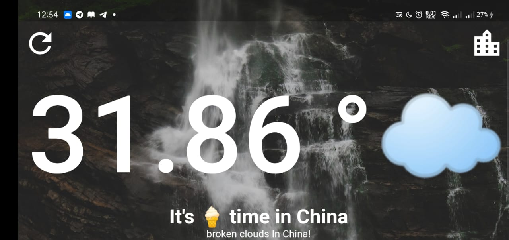

# The☀️Weather

 

  
 
  <h2 align="center"> The☀️Weather </h2>

 

 A Flutter project forg getting the weather form the openweathermap API Based on the Location of the Device or the city the use enter it's name.

---

## Sections

- [Packages And_Dependacies](#Packages_And_Dependacies)
- [App Screen](#App_Screen)

---

## Packages_And_Dependacies

- flutter_spinkit
- http
- geolocator
- connectivity

---

## App_Screen

    <table>
        <tr>
             <td> 
                
            </td> 
            <td>   
                
            </td>          
            <td> 
                
            </td>    
                <td>   
                
            </td>      
        </tr>
    </table>

---

    <table>
        <tr>  
            <td>   
                
            </td>   
            <td> 
                
            </td>   
            <td> 
                
            </td>         
        </tr>
     </table>

